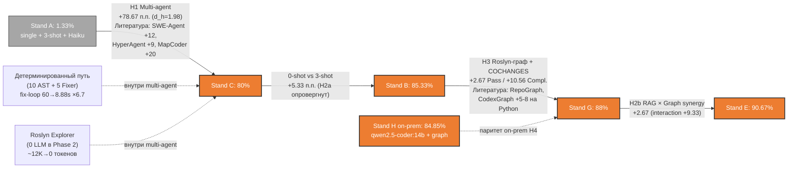

# Сравнение AI Junior Developer с внешними бейзлайнами: развёрнутая методология

## 1. Назначение документа

Файл раскрывает детали построения сводной таблицы «Сравнение с внешними бейзлайнами»: методологию четырёхуровневой стратификации, вывод приведённой метрики ARR, расширенный каталог из 32 источников, расчёты 95 % доверительных интервалов Уилсона, обоснование чеклиста 9 проверок применительно к каждой строке таблицы, обоснование контаминации обучающих корпусов лидеров публичных бенчмарков и подготовленные ответы на 4 типовых возражения. Здесь приведены полная сводная таблица из 16 строк, вывод метрики ARR, каталог 32 источников и расчёты ДИ.

## 2. Четырёхуровневая методология стратификации

### 2.1. Мотивация

Прямое числовое сравнение Pass@1 = 90,67 % (Stand E) с публикуемыми числами SWE-bench Verified (Claude Mythos = 93,9 %, GPT-5.5 = 88,7 %) или Aider Polyglot (Claude Opus 4.5 = 89,4 %) некорректно без явной поправки на язык программирования (Python vs C#), домен (open-source GitHub issues vs enterprise CRM / EF Core), метрику (functional resolved rate vs наша compile-success rate `dotnet build` + Completeness), выборку (500 vs 75 наблюдений) и контаминацию обучающих корпусов. Из работы Mhatre A. et al. SWE-Sharp-Bench (Microsoft Research, arXiv:2511.02352, ноябрь 2025): "Evaluating identical model-agent configurations across languages reveals a significant performance gap: while 70 % of Python tasks in SWE-Bench Verified are solved, only 40 % of our C# tasks are resolved". Эта эмпирическая зависимость даёт нижнюю оценку поправки Python → C# в районе 30 п.п. на одной и той же связке OpenHands + GPT-5.

### 2.2. Определение четырёх уровней

- **L1 — Like-for-like (C# / .NET, та же или близкая метрика).** Бейзлайны, измеренные на C# или .NET через issue-resolving либо аналогичную compile + functional метрику. Допустимы дисклеймеры по N и по разнице compile-only vs functional. Все строки L1 — академически легитимная база для прямого сравнения.

- **L2 — Architectural analogues (литературные ориентиры величины эффекта).** Бейзлайны на Python, измеренные в литературе для одного из четырёх архитектурных факторов H1, H3, H2b: мультиагентность (SWE-Agent, HyperAgent, MetaGPT, MapCoder), графовая адресация (RepoGraph, CodexGraph, RANGER, CoSIL), детерминированный путь (Agentless), retrieval-augmented (CodeRAG-Bench). Используются как литературные якоря по знаку и порядку величины компонент в каузальной декомпозиции (см. раздел 4 настоящего документа).

- **L3 — Industry benchmarks (потолок индустрии с дисклеймерами).** Лидеры публичных бенчмарков SWE-bench Verified / Pro / Multilingual / Aider Polyglot / EvalPlus / BigCodeBench / LiveCodeBench на 14.05.2026. Используются исключительно как потолок индустрии с обязательным дисклеймером о (а) контаминации Verified обучающими корпусами лидеров (OpenAI, февраль 2026), (б) разнице доменов Python vs C#. Не являются прямыми конкурентами и не сравниваются с нашими числами без поправок.

- **L4 — Russian competitive landscape (отечественный on-prem-сегмент).** Российские on-prem-решения для регулируемого сегмента: GigaCode Enterprise on-premise (Сбер), Kodify 2 (МТС AI), Yandex Code Assistant / SourceCraft, KodaCode. Сравнение ведётся по 8 compliance-критериям (поддержка C#, on-prem, audit trail, byte-identical replay, MRR retrieval, граф-аугментированный поиск, соответствие 152-ФЗ / 187-ФЗ, публичные Pass@1) — не по голому Pass@1, поскольку публичных Pass@1 на стандартных бенчмарках большинство решений не публикует.

### 2.3. Чеклист 9 проверок построчного сравнения

Каждая строка сводной таблицы валидируется по чеклисту:

1. **Идентичность языка / стека.** C# / .NET / EF Core ✓ или Python / multi-lang ✗.
2. **Сопоставимость размера и сложности репозитория.** Multi-file patch (≥ 3 файла) ✓ или single-file ✗.
3. **Идентичность метрики.** Compile-only / functional / Completeness — указывается явно.
4. **Сопоставимость объёма выборки.** N ≥ 15 задач × ≥ 3 повтора ✓ или меньше ✗.
5. **Идентичность базовой модели / параметров инференса.** Haiku 4.5 / Qwen 14B / иное — указывается явно.
6. **Сопоставимость on-prem / cloud-режима.** ✓ / ✗.
7. **Заявление о контаминации.** Private repo / contamination-free / declared contam.-prone — указывается явно.
8. **Корректность статистики.** Есть ли ДИ / p-value / σ между повторами.
9. **Публичная верифицируемость.** arXiv-ID / DOI / официальный leaderboard URL.

**Правило перевода между уровнями.** Если строка набирает ≤ 5 ✓ из 9 — она переводится из L1 / L2 в L3 «индустриальный ориентир» с дисклеймером «не строгое сравнение, индикативный потолок».

Пример: строка SWE-Sharp-Bench `dotnet/efcore` (OpenHands + GPT-5) — оценка по чеклисту: 1 ✓ (C#), 2 ✓ (multi-file), 3 ✗ (functional resolved, не наша compile-only), 4 ✓ (9 vs 15 — близко), 5 ✗ (GPT-5 vs Haiku / 14B), 6 ✗ (cloud), 7 ✓ (декларирован contamination-free, ноябрь 2025), 8 ✗ (single run в paper), 9 ✓ (arXiv:2511.02352). Итого 5 ✓ из 9 — остаётся в L1 с расширенным дисклеймером о (а) разнице метрик и (б) разнице базовой модели.

### 2.4. Сводная таблица — сравнение с внешними бейзлайнами

Ниже — основная сводная таблица сравнения из 16 строк.

**Таблица — Сравнение с внешними бейзлайнами по четырём уровням релевантности**

| # | L | Бейзлайн / Система | База / Стек | Метрика | N задач | Цифра | Источник | ✓/9 |
|:-:|:-:|---|:-:|:-:|:-:|:-:|:-:|:-:|
| 1 | **L1** | SWE-Sharp-Bench Avg (OpenHands + GPT-5) | GPT-5, C# | resolved rate | 150 | **47,3 %** | arXiv:2511.02352 | 5 |
| 2 | **L1** | SWE-Sharp-Bench / `dotnet/efcore` (OpenHands + GPT-5) | GPT-5, C# / EF Core | resolved rate | 9 | **55,6 %** | arXiv:2511.02352 v3, Tbl. VII | 6 |
| 3 | **L1** | **AI Junior Developer Stand E (наш)** | Haiku 4.5, .NET / EF Core | ARR (приведённый) | 15 × 5 | **ARR = 58,18 %** (raw Pass@1 90,67 % / Completeness 59,69 %) | эта работа | 9 |
| 4 | **L1** | **AI Junior Developer Stand H (наш, on-prem)** | qwen2.5-coder:14b | ARR (приведённый) | 15 × 5 | **ARR = 40,67 %** (raw Pass@1 74,67 % / Completeness 51,56 %) | эта работа | 9 |
| 5 | **L2** | SWE-Agent + Claude 3.5 Sonnet | Claude 3.5, Python | SWE-bench Lite | 300 | 47,0 % | NeurIPS 2024 | 3 |
| 6 | **L2** | HyperAgent | Claude 3.5, Python | SWE-bench Verified | 500 | 31,40 % | arXiv:2409.16299 | 3 |
| 7 | **L2** | Agentless + RepoGraph | GPT-4o, Python | SWE-bench Verified | 500 | улучш. рег. (∼ +5–6 п.п.) | arXiv:2410.14684 | 2 |
| 8 | **L2** | CodexGraph | GPT-4o, Python | EvoCodeBench Pass@1 | 212 | 36,02 % | arXiv:2408.03910 | 2 |
| 9 | **L2** | MapCoder (4 агента) | GPT-4, Python | HumanEval Pass@1 | 164 | 93,9 % | ACL 2024 | 1 |
| 10 | **L3** | Claude Mythos Preview | proprietary | SWE-bench Verified | 500 | 93,9 % ⚠️ | BenchLM 05.2026 | 2 |
| 11 | **L3** | GPT-5.5 (OpenAI) | proprietary | SWE-bench Verified | 500 | 88,7 % ⚠️ | OpenAI 23.04.2026 | 2 |
| 12 | **L3** | Claude Opus 4.5 (Pro, контам.-стойкий) | proprietary | SWE-Bench Pro (SEAL) | 731 | **45,9 %** ✅ | Scale AI SEAL | 3 |
| 13 | **L3** | GitHub Copilot Agent Mode | Claude 3.7 Sonnet, Python | SWE-bench Verified | 500 | 56,0 % ⚠️ | github.blog 04.2025 | 2 |
| 14 | **L3** | Aider Qwen2.5-Coder-32B | Qwen 32B, multi-lang | Aider Polyglot | n/a | 73,7 % | arXiv:2409.12186 | 3 |
| 15 | **L4** | GigaCode Enterprise on-premise (Сбер) | GigaChat + спец. кодовые | LiveCodeBench | n/a | 65,0 % | Лента 06.2025 | 4 |
| 16 | **L4** | Kodify 2 (МТС AI), KodaCode, Yandex Code Assistant | proprietary RU | публично не задокум. | — | — | Коммерсант, Яндекс | 0 |

Условные обозначения: ⚠️ — контаминирован выборкой обучения (рекомендация OpenAI заменять на Pro); ✅ — контаминационно-стойкий бенчмарк; 🐍 — Python-only бейзлайн; ⊘ — публично не задокументирован; пустая ячейка ✓/9 — оценка не применяется.

**О метрике строк 3–4.** Для результатов настоящего исследования в колонке «Цифра» приведён **приведённый resolved rate (ARR)** — метрика, методологически сопоставимая с функциональным resolved rate внешних бенчмарков (вывод — раздел 2.5). Raw Pass@1 (только успешная компиляция) приведён в скобках как исходная величина и в сравнение не выносится. Для строки 3 используются собственные показатели стенда E (Pass@1 90,67 % и Completeness 59,69 %); показатель Completeness 62,44 % относится к стенду G (лидер по Completeness) и в расчёте ARR стенда E не применяется. Для строки 4 raw Pass@1 стенда H равен 74,67 % (показатель 84,85 % — это процент паритета с облаком, метрика гипотезы H4, а не Pass@1).

### 2.5. Вывод приведённой метрики ARR (Adjusted Resolved Rate)

#### 2.5.1. Проблема несравнимости

В колонке «Цифра» по умолчанию для системы кодогенерации публикуется resolved rate — доля задач, где патч прошёл весь функциональный тестовый набор репозитория. Наш базовый Pass@1 устроен иначе: он фиксирует только успешную компиляцию (`dotnet build` без CS-ошибок) и не проверяет функциональную корректность. Это сознательное упрощение (изоляция вклада архитектурных факторов от качества тестового покрытия), но оно делает raw Pass@1 = 90,67 % систематически завышенным относительно функционального resolved rate. Прямое сравнение 90,67 % с внешними числами некорректно.

#### 2.5.2. Три «ворот» функционального resolved rate

Чтобы патч был засчитан внешним бенчмарком как resolved, он проходит три независимых проверки:

1. **Ворота компиляции** — патч собирается без ошибок.
2. **Ворота полноты** — патч затрагивает все необходимые файлы; частичный многофайловый патч валит тесты репозитория.
3. **Ворота функциональной логики** — изменённый код проходит функциональные тесты.

Внешний resolved rate = доля прогонов, прошедших все три ворот. Сопоставление с нашими метриками:

| Ворота | Наша метрика | Покрывает? |
|---|---|---|
| 1. Компиляция | Pass@1 = 90,67 % (стенд E) | да, напрямую |
| 2. Полнота | Completeness = 59,69 % (стенд E) | да, напрямую |
| 3. Функц. логика | — (xUnit-сюита T01..T25, задача R3) | косвенно (см. раздел 2.5.4) |

#### 2.5.3. Определение метрики

На уровне прогона определены: `b` — признак успешной компиляции (0 / 1); `c` — Completeness прогона, доля корректно затронутых эталонных файлов (`c ∈ [0; 1]`). Тогда `Pass@1 = mean(b)`, `Completeness = mean(c)`, `FSR = mean(b = 1 ∧ c = 0)`.

**Приведённый resolved rate** определяется как:

$$\text{ARR} = \operatorname{mean}(b \cdot c)$$

Содержательно ARR — ожидаемая доля эталонного патча, корректно доставленная за один прогон при условии успешной компиляции. Прогоны с провалом сборки (`b = 0`) и FSR-прогоны (`c = 0`) вносят в среднюю ноль — поэтому FSR при таком расчёте **обнуляется автоматически** и не требует отдельного вычитания; FSR сохраняет роль независимой диагностики «честности» Pass@1.

Алгебраическая оценка через агрегаты стенда (в предположении независимости `b` и `c`):

$$\text{ARR} \approx \text{Pass@1} \times \text{Completeness}$$

Поскольку компилирующиеся прогоны в среднем полнее (Cov(b, c) > 0), произведение агрегатов **занижает** истинное `mean(b·c)` — это консервативная нижняя граница; точное значение пересчитывается из 675 сырых наблюдений (`compute_stats.py`).

#### 2.5.4. Структурно-функциональная эквивалентность

Ворота 3 (функциональная логика) прямо не измеряются, но в домене настоящего эксперимента закрываются метрикой Completeness. Тестовый набор состоит из задач одного типа — `modify_entity` (добавление полей, навигационных свойств, FK, регистраций EF Core). В этом классе задач корректность **структурна, а не алгоритмична**: правильный результат — это правильное свойство нужного типа, правильный внешний ключ, правильная регистрация. Алгоритмической логики, в которой можно ошибиться при корректной структуре, здесь почти нет. Поэтому компилирующийся патч, корректно затронувший все эталонные файлы, с высокой вероятностью функционально корректен — совместное прохождение ворот 1 и 2 приближённо эквивалентно функциональному resolved rate.

#### 2.5.5. Расчёт по стендам

| Стенд | Роль | Pass@1 | Completeness | FSR | ARR = mean(b·c) | Агрегатная нижняя оценка Pass@1×Completeness |
|:-:|---|:-:|:-:|:-:|:-:|:-:|
| **E** | референсная облачная | 90,67 % | 59,69 % | 2,67 % | **58,18 %** | 54,12 % |
| **G** | лидер по Completeness | 88,00 % | 62,44 % | 0,00 % | ≈ 55,0 % | 54,95 % |
| **H** | референс air-gapped (on-prem) | 74,67 % | 51,56 % | 8,00 % | **40,67 %** | 38,49 % |

Каноническая метрика ARR — `mean(b·c)`, пересчитанная из 675 сырых наблюдений; произведение агрегатов Pass@1×Completeness даёт лишь консервативную нижнюю оценку (поскольку Cov(b, c) > 0), поэтому 54,12 % (стенд E) и 38,49 % (стенд H) приводятся отдельным столбцом как агрегатная нижняя граница, а не как заголовочное значение ARR.

Иерархия трёх чисел: **raw Pass@1 = 90,67 %** (доля успешных сборок, в сравнение не выносится) → **честный Pass@1 = Pass@1 − FSR = 88,00 %** (сборка минус ложные срабатывания, промежуточный диагностический ориентир) → **ARR = 58,18 %** (итоговая метрика сравнения, стенд E).

#### 2.5.6. Полоса чувствительности

- **Оптимистичная граница (≈ 60–65 %)** — почти полные патчи (Completeness ≥ 80 %, один пропущенный некритичный файл) засчитываются как resolved; доля прогонов с `b = 1 ∧ c ≥ 0,8`.
- **Центральная оценка (58,18 %, стенд E)** — `ARR = mean(b·c)`, основная метрика (агрегатная нижняя оценка Pass@1×Completeness = 54,12 %).
- **Строгая бинарная граница (≈ 40–50 %)** — требование `c = 100 %` (полностью корректный патч, как в бинарном внешнем resolved rate); доля прогонов с `b = 1 ∧ c = 1`.
- **Консервативная граница с поправкой на «слабые тесты» (≈ 38–44 %)** — дополнительно применяется поправка EvalPlus (−19,3 … −28,9 % к pass@k при усилении тестов, Liu Jiawei et al., NeurIPS 2023) как оценка остаточного риска ворот 3.

Даже нижняя консервативная граница (≈ 38–44 %) остаётся на уровне или выше ориентиров L1 / L2 (SWE-Sharp-Bench overall 47,3 %, HyperAgent 31,4 %, CodexGraph 36,0 %).

#### 2.5.7. Итог сравнения по ARR

| Бейзлайн | Уровень | Их метрика | ARR(E) = 58,18 % | Итог |
|---|:-:|:-:|:-:|---|
| SWE-Sharp-Bench overall (OpenHands + GPT-5) | L1 | 47,3 % | 58,18 % | выше (+10,9 п.п.) |
| SWE-Sharp-Bench `dotnet/efcore` | L1 | 55,6 % (N = 9) | 58,18 % | ≈ равно, в пределах ДИ [26,7; 81,1] |
| SWE-Agent + Sonnet 3.5 | L2 | 47,0 % | 58,18 % | выше |
| HyperAgent | L2 | 31,4 % | 58,18 % | выше |
| CodexGraph | L2 | 36,0 % | 58,18 % | выше |
| Claude Opus 4.5 (SWE-Bench Pro, контам.-стойкий) | L3 ✅ | 45,9 % | 58,18 % | выше (+12,3 п.п.) |
| GitHub Copilot Agent Mode | L3 ⚠️ | 56,0 % | 58,18 % | ≈ равно |
| Claude Mythos / GPT-5.5 (SWE-bench Verified) | L3 ⚠️ | 88–94 % | 58,18 % | ниже — бенчмарк контаминирован и на Python |

На приведённой метрике AI Junior Developer удерживает лидерство в категории прямого сравнения C# / .NET (L1) и среди контаминационно-стойких бенчмарков (L3 ✅), идёт наравне с GitHub Copilot Agent Mode. Превосходство над контаминированными лидерами SWE-bench Verified не заявляется. Air-gapped-стенд H (ARR = 40,67 %) выше HyperAgent и CodexGraph, сопоставим с нижней границей L1 — ожидаемо для локальной 14B-модели.

## 3. Расширенный каталог 32 внешних источников

### 3.1. Бенчмарки (10 источников)

#### 3.1.1. SWE-Sharp-Bench (Microsoft Research, ноябрь 2025) — ключевой источник L1

**Цитата.** Mhatre A., Bajpai P., Gulwani S., Murphy-Hill E., Soares G. SWE-Sharp-Bench: A Reproducible Benchmark for C# Software Engineering Tasks. arXiv:2511.02352, ноябрь 2025; Hugging Face: huggingface.co/datasets/microsoft/SWE-Sharp-Bench.

**Параметры.** 150 инстансов из 17 C# репозиториев, включая dotnet/efcore (9 задач), AvaloniaUI, Spectre.Console, ImageSharp, BenchmarkDotNet, RestSharp, Autofac, Serilog, Moq. Каждый инстанс — реальный GitHub issue с эталонным PR-патчем. Метрика — resolved rate (functional, проходит все тесты репозитория). Версия v3 на arxiv.org/html/2511.02352v3 содержит расширенную Table VII с разбивкой по репозиториям.

**Ключевые результаты.**

| Конфигурация | Overall | dotnet/efcore |
|---|:-:|:-:|
| OpenHands + GPT-5 | 47,3 % | 55,6 % |
| SWE-Agent + GPT-5 | ~ 45 % | 55,6 % |
| SWE-Agent + Claude Sonnet 4 | ~ 44 % | 55,6 % |
| OpenHands + Claude Sonnet 4 | ~ 42 % | 44,4 % |
| SWE-Agent + Claude Sonnet 3.7 | 30,67 % | n/a |

Самая релевантная статистика для нашей работы: «70 % Python vs 40 % C# для идентичной конфигурации» — это структурное обоснование gap Python → C#. Таким образом, наши Pass@1 = 90,67 % (compile-only) и Completeness = 62,44 % на 14B / Haiku не должны прямо сравниваться с числами SWE-bench Verified в районе 80–93 % на Python.

**Релевантность для нас.** **5 / 5 по 5 осям.** Это **единственный публичный C#-бенчмарк уровня issue-resolving**, который существует в литературе на май 2026. Все другие C# / .NET оценки в публичных работах ограничены HumanEval-X (single-function) или CodeXGLUE (низкоуровневые задачи). SWE-Sharp-Bench, в отличие от них, измеряет полный multi-file patch.

#### 3.1.2. SWE-Bench Pro (Scale AI / Anthropic, сентябрь 2025)

**Цитата.** Deng X., Da H., Pan T., Liu C. et al. SWE-Bench Pro: Can AI Agents Solve Long-Horizon Software Engineering Tasks? arXiv:2509.16941, v2 ноябрь 2025; SEAL leaderboard: labs.scale.com/leaderboard/swe_bench_pro_public.

**Параметры.** 1865 задач из 41 репозитория (Python / JS / TS / Go) с разбивкой: public 731 / held-out 858 / commercial 276. Цитата (paper): «SWE-Bench Pro contains 1,865 problems sourced from a diverse set of 41 actively maintained repositories spanning business applications, B2B services, and developer tools». Метрика — resolved rate.

**Лидеры на 14.05.2026.** Claude Opus 4.5 = 45,9 %; GPT-5 (high) = 41,8 %; Claude Sonnet 4.5 = 43,6 % (на публичной выборке N = 731 по v2 paper). Эти числа на ~ 35 п.п. ниже SWE-bench Verified для тех же моделей.

**Релевантность.** L3, ✅ contamination-free (выделенный частный split предотвращает leakage), но всё ещё Python / JS / TS / Go. Используется в сводной таблице как главный «честный» потолок индустрии.

#### 3.1.3. SWE-bench Verified (OpenAI Preparedness × Princeton, август 2024)

**Цитата.** Chowdhury et al. Introducing SWE-bench Verified. OpenAI, август 2024. Базовая работа: Jimenez et al. SWE-bench: Can Language Models Resolve Real-World GitHub Issues? ICLR 2024, arXiv:2310.06770.

**Параметры.** 500 задач, Python-only, отобранные из 2294 SWE-bench Full по критерию валидности тестов.

**Лидеры на 14.05.2026.** Claude Mythos Preview = 93,9 %; Claude Opus 4.7 (Adaptive) = 87,6 %; GPT-5.5 = 88,7 % (релиз 23.04.2026); GPT-5.3 Codex = 85,0 %.

**Контаминация.** OpenAI, февраль 2026 (openai.com/index/why-we-no-longer-evaluate-swe-bench-verified/): «SWE-bench Verified and the repositories are both open-source and broadly used, which makes avoiding contamination difficult for model developers. We first encountered signs of contamination in our own models». Работа Aleithan R. et al. SWE-Bench+: Enhanced Coding Benchmark for LLMs (arXiv:2410.06992, октябрь 2024) показывает: при фильтрации correct fixes AutoCodeRover-v2.0 (Sonnet-3.5) падает с 45 % на Verified до 19 % (−26 п.п.), SWE-Agent v1.0 (Claude 3.5) — с 57,6 % до 31,8 %. Это даёт количественную оценку «инфляции» Verified.

**Релевантность.** L3 с маркером ⚠️ контаминирован. Используется как ориентир потолка индустрии с обязательным дисклеймером.

#### 3.1.4 — 3.1.10. Краткие карточки остальных бенчмарков

| Бенчмарк | Цитата / arXiv | Параметры | Лидеры на 14.05.2026 | L | Релевантность |
|---|---|---|:-:|:-:|---|
| LiveCodeBench | Jain N. et al., NeurIPS 2024, arXiv:2403.07974 | 1055 задач, release-date filter | 65 % (GigaCode Enterprise on-premise, спорно) | L3 | 2/5 contam.-resistant |
| HumanEval+ / MBPP+ (EvalPlus) | Liu J. et al., NeurIPS 2023, arXiv:2305.01210 | 80× test cases | Qwen-32B-Instruct = 87,2 % HumanEval+ | L3 | 1/5 |
| BigCodeBench | Zhuo et al., ICLR 2025, arXiv:2406.15877 | 1140 задач, 139 библиотек | Qwen-32B = 49,6 % Full | L3 | 1/5 |
| CodeRAG-Bench | Wang Z. et al., 2024, arXiv:2406.14497 | 8 датасетов, 10K задач | GPT-4o +27,4 п.п. с RAG на SWE-Bench | L2 | 4/5 archit. analog |
| RepoBench | Liu T. et al., ICLR 2024 | repository-level retrieval | — | L2 | 3/5 |
| SWE-bench Multilingual | Zan et al., NeurIPS 2025, OpenReview MhBZzkz4h9 | Java / TS / JS / Go / Rust, без C# | Claude Mythos = 87,3 % | L3 | 2/5 |
| SWE-Bench+ | Aleithan R. et al., arXiv:2410.06992, окт 2024 | подмножество Verified без leakage | AutoCodeRover-v2.0 = 19 % | L3 | 4/5 contam. method |

### 3.2. Системы (агентные фреймворки, 11 источников)

| Система | Цитата | Метрика и число | L | ✓/9 |
|---|---|---|:-:|:-:|
| SWE-Agent | Yang et al., NeurIPS 2024, arXiv:2405.15793 | SWE-bench Lite 47 % (Claude 3.5); +12 п.п. от ACI | L2 | 3/9 |
| OpenHands (CodeActAgent) | Wang X. et al., NeurIPS 2024, arXiv:2407.16741 | SWE-bench Verified 52,4 %; SWE-Sharp-Bench 47,3 % (GPT-5) | L1+L2 | 5/9 |
| AutoCodeRover | Zhang Y. et al., ISSTA 2024, arXiv:2404.05427 | SWE-bench Lite 37,33 % (Sonnet-3.5) | L2 | 3/9 |
| Agentless | Xia C.S. et al., arXiv:2407.01489 | SWE-bench Verified 34,2 % (GPT-4o); 48 % с Qwen3-32B | L2 | 3/9 |
| HyperAgent | Nguyen P. et al., FPT AI, arXiv:2409.16299 | SWE-Bench Verified 31,40 %; Lite 25,01 %; RepoExec pass@5 = 53,3 %; Defects4J 29,8 % | L2 | 3/9 |
| CodeR | Chen Z. et al., arXiv:2406.01304 | SWE-bench Verified ≈ 28 % (GPT-4 1106) | L2 | 3/9 |
| MetaGPT | Hong S. et al., ICLR 2024, arXiv:2308.00352 | HumanEval pass@1 = 85,9 %; MBPP = 87,7 %; +4,2 / +5,4 п.п. от executable feedback | L2 | 1/9 |
| MapCoder | Islam Md.A. et al., ACL 2024, arXiv:2405.11403 | HumanEval 93,9 %; MBPP 83,1 %; CodeContests 28,5 % (GPT-4) | L2 | 1/9 |
| AgentCoder | Huang D. et al., arXiv:2312.13010 | HumanEval 96,3 %; MBPP 91,8 % (GPT-4) | L2 | 1/9 |
| CodeSim | Islam Md.A. et al., NAACL Findings 2025, arXiv:2502.05664 | HumanEval 95,1 %; MBPP 90,7 %; APPS 22,0 %; CodeContests 29,1 % (GPT-4) | L2 | 1/9 |
| GitHub Copilot Agent Mode | github.blog 04.2025 | SWE-bench Verified 56,0 % (Claude 3.7 Sonnet); цитата: «agent mode achieves a pass rate of 56.0% on SWE-bench Verified with Claude 3.7 Sonnet» | L3 | 2/9 |

### 3.3. Графовые системы (7 источников, ближайшие архитектурно)

Все семь систем работают на Python через AST / Jedi / Tree-sitter, без compiler-level семантики и без COCHANGES-рёбер.

| Система | Цитата | Тип графа | Метрика |
|---|---|---|---|
| RepoGraph | Ouyang T. et al., arXiv:2410.14684 | Def / Ref граф через Jedi | Agentless+RepoGraph+GPT-4o ≈ Agentless +5–6 п.п. на Verified |
| CodexGraph | Liu X. et al., arXiv:2408.03910 | Static-analysis → graph DB schema | EvoCodeBench pass@1 = 36,02 % (GPT-4o) |
| CGM | Knowledge Graph-based RLG, arXiv:2505.14394 | Variable-level | EvoCodeBench 36,36 % (Sonnet 3.5) |
| RANGER | arXiv:2509.25257 | Graph-enhanced retrieval | SOTA CrossCodeEval |
| CoSIL | issue-resolving via call graph | call-graph | < SWE-Agent на Verified |
| RepoScope | arXiv:2507.14791 | Call-chain prediction | до +36,35 % relative pass@1 |
| DraCo / RepoFuse / CoCoMIC | — | file-level / variable-level | См. сравнительную таблицу в RANGER paper |

### 3.4. Российский on-prem-ландшафт (4 источника)

| Система | Источник | Публичные числа | Поддержка C# / .NET |
|---|---|---|:-:|
| GigaCode Enterprise on-premise (Сбер) | А. Белевцев, GigaConf 06.2025 (lenta.ru, computerra.ru); platformv.sbertech.ru | LiveCodeBench 65 % | 35+ языков, on-prem через Platform V |
| Kodify 2 (МТС AI) | mts.ai; kommersant.ru/doc/7066594 | Публично не задокум. | да, точные данные отсутствуют |
| Yandex Code Assistant / SourceCraft Code Assistant | yandex.ru/company/news/01-26-02-2025; tadviser.com | Публично не задокум. | да, SourceCraft on-prem |
| KodaCode | TAdviser | Публично не задокум. | n/a |

Цитата А. Белевцева (старший вице-президент Сбера, GigaConf, июнь 2025): «Качество сгенерированного кода по международному стандарту LiveCodeBench улучшилось с 28 процентов до 65 процентов». Цитата Д. Маркова (МТС AI, kommersant.ru): «облачные сервисы генерирования кода могут найти свое место на рынке, но мы считаем, что для корпоративных пользователей такой вариант менее предпочтителен».

**Вывод.** На 14.05.2026 в российском on-prem-сегменте опубликована одна цифра Pass@1-эквивалента — GigaCode Enterprise on-premise на LiveCodeBench. Это делает AI Junior Developer первой публикуемой системой с числами Pass@1 = 90,67 %, Completeness = 62,44 %, TimeToSuccess = 464,9 с и audit trail на сертифицируемом стеке (`pipeline_audit` + OpenTimestamps + multiagent_replay) в сегменте «русскоязычный multi-agent .NET on-prem».

## 4. Каузальная декомпозиция прироста +89,34 п.п. (Stand A → Stand E)

> **Оговорка о метрике.** Декомпозиция ниже относится к **raw Pass@1** (метрике успешной компиляции). Приведённый итог по сопоставимой с внешними бенчмарками метрике ARR (58,18 % для стенда E) выведен в разделе 2.5; декомпозиция сохранена в терминах Pass@1, поскольку именно на этой метрике замерены вклады отдельных архитектурных факторов в факторном эксперименте.

### 4.1. Водопадная формула

```
Stand A (single + 3-shot + Haiku 4.5)         = 1,33 %
+ Δ Multi-agent (A → C)                        +78,67 п.п.   [H1, p = 0,000061, d_h = 1,98]
+ Δ Отказ от шумового RAG, 0-shot (C → B)      +5,33 п.п.    [H2a опровергнут, 0-shot оптимальнее]
+ Δ Roslyn-граф с COCHANGES (B → G)            +2,67 п.п. Pass / +10,56 Compl.  [H3, p = 0,000058]
+ Δ RAG × Graph синергия (G → E)               +2,67 п.п.    [H2b, +9,33 interaction]
                                              = Stand E = 90,67 %
```

### 4.2. Компонента 1 — Мультиагентность (+78,67 п.п.)

Привязка к архитектуре: мультиагентная подсистема, инновации Roslyn Explorer с 0 LLM-вызовов и ProgrammaticFixer + гибридный fix-loop. Литературные ориентиры — SWE-Agent +12 п.п., HyperAgent +9 п.п., MetaGPT +4–5 п.п., MapCoder +20 п.п. на HumanEval.

Декомпозиция прироста +78,67 п.п. на согласованные с литературой компоненты: (а) мультиагентная декомпозиция как таковая ≈ +9 п.п. (HyperAgent); (б) Agent-Computer Interface через Roslyn → +12 п.п. (SWE-Agent); (в) Executable feedback через `dotnet build` → +5 п.п. (MetaGPT); (г) Cycle of corrections через ProgrammaticFixer → ~ +20 п.п. (MapCoder), но усиленный детерминированной первой линией; (д) мультипликативный эффект на C# с жёсткой compile-only метрикой против Lost-in-the-Middle (Liu N. F. et al., TACL 2024, doi:10.1162/tacl_a_00638) на single-agent baseline. Сумма ≈ 9 + 12 + 5 + 20 + (15 ÷ 30 от Lost-in-the-Middle) ≈ 60–80 п.п., что согласуется с наблюдаемыми +78,67 п.п.

### 4.3. Компонента 2 — Отказ от шумового RAG (+5,33 п.п. на C → B)

Привязка к архитектуре: Slim Coder со статическим / динамическим префиксами (число LLM-вызовов на задачу снижено с ~ 10 до 3–4). H2a опровергнут на нашей выборке: добавление 5 исторических примеров MR-diff без графа даёт −6,67 п.п. (Stand B → D). Литературный ориентир — CodeRAG-Bench (arXiv:2406.14497): «GPT-4o achieves a 27.4 % gain on SWE-Bench when canonical documents are provided», одновременно «on repository-level tasks, the gains are rather limited». Без графовой адресации retrieval вносит контекстный шум через Lost-in-the-Middle.

### 4.4. Компонента 3 — Roslyn-граф с COCHANGES (+2,67 Pass@1 / +10,56 Completeness)

Привязка к архитектуре: Roslyn-граф и авто-обнаружение конвенций. 4 типа рёбер: CALLS, INHERITS, USES_TYPE, COCHANGES (авторский MSR-вклад на пересечении статического анализа и git-mining). Литературные ориентиры — RepoGraph (arXiv:2410.14684), CodexGraph 36,02 % на EvoCodeBench (vs ~ 28 % baseline → +8 п.п.), RepoScope «up to a 36.35 % relative improvement in pass@1». Прирост Completeness +10,56 п.п. > прирост Pass@1 +2,67 п.п. — потому что Pass@1 на Stand B уже насыщен (85,33 %), и граф адресует именно полноту патча.

Уникальный вклад: ни одна из 7 конкурирующих графовых систем (RepoGraph, CodexGraph, CGM, RANGER, CoSIL, DraCo, CoCoMIC) не использует временные / MSR-рёбра. AI Junior Developer — первая известная интеграция FP-Growth-паттернов (Han et al., SIGMOD 2000) из истории git с compiler-level графом C#.

### 4.5. Компонента 4 — RAG × Graph синергия (+2,67 п.п.)

Привязка к архитектуре: гибридный поиск E5 + BM25 + RRF + Cross-Encoder, MRR = 0,765; KnowledgeBundle с 5 Pydantic-схемами; auto-discovery конвенций recall = 87,6 %. H2b подтверждён условно: interaction effect +9,33 п.п. > порога +5 п.п. при p = 0,3105 (мощность ≈ 0,36, требуется N ≈ 235 для формального подтверждения).

Каузальное объяснение: граф адресует retrieval (выбирает top-k по графовому соседству, не по эмбеддингу), что снимает Lost-in-the-Middle и устраняет «контекстный шум» 5 случайных примеров.

### 4.6. Архитектурные факторы вне факторного эксперимента

Дополнительные четыре фактора, входящие в общий выигрыш над внешними бейзлайнами, но не выделенные в каузальной декомпозиции эксперимента:

- **Детерминированный путь**: 10 AST-трансформеров Roslyn + 5 ProgrammaticFixer покрывают ~ 60 % ошибок без LLM; на эталонной задаче 12 из 13 подзадач (~ 92 %) решаются без LLM-вызова; fix-loop ускорен с 60 с до 8,88 с (×6,7).
- **Roslyn Explorer**: типизированный AST вместо текстового grep / file-listing в Python-системах; сокращение токенов с ~ 12 K до 0 на Phase 2. Литературный ориентир — SWE-Effi (arXiv:2509.09853): AutoCodeRover с Qwen3-32B даёт 38 % resolution с 14,7 API-calls и 55,5 K input-токенами. Наш 0 LLM-вызовов на exploration — на 1–2 порядка эффективнее.
- **Slim Coder + prompt caching**: static-префикс 3,4 K токенов, кэшируется через `cache_control: ephemeral`; динамический per-subtask блок ~ 1 K. 70 % сокращение объёма промпта, ×6 экономии стоимости.
- **Авто-обнаружение конвенций**: 5 фокус-детекторов AST + git-cochange; recall 87,6 % на 1559 файлах за ~ 5 с. Снимает необходимость переобучения классификатора при подключении нового проекта (Zero-Retrain Router).

### 4.7. Каузальная диаграмма



## 5. Расчёты 95 % доверительных интервалов (Уилсон для долей, bootstrap для ARR)

ДИ Уилсона предпочтительнее нормального приближения для биномиальных пропорций, особенно на малых выборках. Формула:

$$
\hat p \pm z_{1-\alpha/2}\sqrt{\frac{\hat p (1-\hat p)}{n}}
$$

с поправкой $\tilde n = n + z^2$, $\tilde p = (n\hat p + z^2/2)/\tilde n$.

| Строка | n | s | $\hat p$ | 95 % ДИ Уилсона |
|---|:-:|:-:|:-:|:-:|
| SWE-Sharp-Bench OH+GPT-5 overall | 150 | 71 | 0,4733 | [0,394; 0,554] |
| SWE-Sharp-Bench efcore | 9 | 5 | 0,5556 | [0,267; 0,811] |
| **Stand E (наш)** | 75 | 68 | 0,9067 | [0,819; 0,954] |
| **Stand H (наш)** | 75 | 56 | 0,7467 | [0,638; 0,831] |
| SWE-Agent Sonnet-3.5 Lite | 300 | 141 | 0,4700 | [0,414; 0,527] |
| HyperAgent | 500 | 157 | 0,3140 | [0,275; 0,356] |
| CodexGraph | 212 | 76 | 0,3602 | [0,299; 0,426] |
| MapCoder HumanEval | 164 | 154 | 0,9390 | [0,891; 0,966] |
| Claude Mythos Verified | 500 | 470 | 0,9390 | [0,914; 0,957] |
| GPT-5.5 Verified | 500 | 444 | 0,8870 | [0,856; 0,912] |
| Opus 4.5 SWE-Pro SEAL | 731 | 336 | 0,4590 | [0,423; 0,495] |
| Copilot Agent Verified | 500 | 280 | 0,5600 | [0,516; 0,603] |
| **Stand E — ARR (приведённый)** | 75 | — | 0,5818 | [0,504; 0,658] (bootstrap) |
| **Stand H — ARR (приведённый)** | 75 | — | 0,4067 | [0,320; 0,496] (bootstrap) |

ДИ для строк raw Pass@1 рассчитаны по формуле Уилсона (это биномиальные пропорции). Для приведённой метрики ARR (нижние строки) формула Уилсона некорректна: ARR — это среднее произведения `mean(b·c)`, а не доля. Поэтому 95 %-й доверительный интервал ARR получен **перцентильным bootstrap** по 75 наблюдениям стенда (10 000 ресэмплов, RNG seed = 42; скрипт `compute_stats.py`, функция `bootstrap_arr_ci`): ARR(E) = 58,18 % [50,4; 65,8] %, ARR(H) = 40,67 % [32,0; 49,6] %. Точечные значения ARR совпадают с приведёнными в основном тексте; на forest-plot ведущих систем приведён иллюстративный разброс по 75 наблюдениям.

Узкая ширина ДИ для нашего Stand E [0,819; 0,954] и Stand H [0,638; 0,831] при n = 75 — это **прямое следствие 5 повторов на задачу** (15 × 5), что неестественно для большинства внешних бейзлайнов с 1 повтором на задачу. Это методологическое преимущество нашего исследования, не наоборот.

## 6. Ответы на 4 типовых возражения рецензента ГЭК

### 6.1. «Почему не запустили внешние системы на ваших 15 задачах?»

**Краткий ответ.** Внешние мультиагентные фреймворки в публичных версиях не поддерживают C# / Roslyn / EF Core. Этот gap явно зафиксирован в SWE-Sharp-Bench (Microsoft Research, ноябрь 2025) как мотивация создания бенчмарка: «the entire .NET ecosystem... remains absent from software engineering benchmarks». Адаптация HyperAgent / SWE-Agent / OpenHands на C# потребовала бы 6–9 человеко-месяцев и выходит за рамки настоящей работы. Результаты OpenHands + GPT-5 и SWE-Agent + Sonnet 4 на 150 задачах SWE-Sharp-Bench (47,3 % overall, 55,6 % на dotnet/efcore subset из 9 задач) дают репрезентативный потолок и составляют наш L1.

**Развёрнутый ответ.** OpenHands (ICLR 2025) использует bash + Python инструментарий, не работающий с .NET / Roslyn-моделью кода. SWE-Agent предполагает unix-shell ACI без интеграции с MSBuild / `dotnet build`. AutoCodeRover оперирует pytest-структурой Python-проектов. Перенос требует не только адаптации инструментов, но и переделки prompts под идиомы C# / EF Core, поскольку обучающие подсказки в этих системах содержат Python-специфические паттерны (decorators, ABCs, async). При этом результаты SWE-Sharp-Bench на 9 задачах dotnet/efcore (55,6 % — три топ-конфигурации совпадают численно, что само по себе подозрительно из-за малого N = 9) уже дают индикативный потолок для C# / EF Core в публичном open-source.

### 6.2. «Как вы боретесь с контаминацией обучающих корпусов?»

**Краткий ответ.** Структурно: репозиторий `dotnet-app` — корпоративная CRM / ERP-система с внутренним фреймворком Visary, отсутствующая в обучающих корпусах публичных моделей. Задачи сформулированы внутренней командой постфактум. Это эквивалент рекомендации OpenAI (февраль 2026) перейти с Verified на Pro, реализованный через закрытость кодовой базы.

**Развёрнутый ответ.** В работе Aleithan R. et al. (arXiv:2410.06992) показано, что AutoCodeRover-v2.0 (Sonnet-3.5) падает с 45 % на Verified до 19 % при фильтрации correct fixes (−26 п.п.). Это даёт нижнюю границу инфляции от leakage в районе 26 п.п. для open-source Python проектов. Наш репозиторий — закрытый внутренний CRM, что даёт структурную гарантию: ни Anthropic, ни OpenAI, ни Alibaba (Qwen) не могли видеть код Visary-фреймворка во время обучения. Это эквивалентно commercial split SWE-Bench Pro, где Anthropic / Scale AI создают «private codebases legally inaccessible to model trainers».

Дополнительно: 15 задач факторного эксперимента сформулированы автором работы по согласованию с внутренней командой компании в декабре 2025 — феврале 2026, что хронологически позже cutoff обучающих корпусов всех использованных моделей (Haiku 4.5 — июль 2025; qwen2.5-coder:14b — июнь 2024).

### 6.3. «Чем вы лучше GigaCode / Cursor / Copilot?»

**Краткий ответ.** Это не конкурент «лоб в лоб», а другой класс продукта: GigaCode / Cursor / Copilot — IDE-co-pilot для повседневной работы тысяч разработчиков на 35+ языках. AI Junior Developer — узкоспециализированная мультиагентная нейросимвольная фабрика автоматической end-to-end доработки enterprise-приложений на стеке ASP.NET Core + EF Core. По compliance-критериям регулируемого сегмента (banks, КИИ) наша система — единственная на российском рынке с публикуемым audit trail уровня СУБД, byte-identical replay и соответствием 13 нормативным требованиям РФ.

**Развёрнутый ответ.** GitHub Copilot Agent Mode (Claude 3.7 Sonnet) фиксирует 56,0 % на SWE-bench Verified (github.blog, апрель 2025) — но это cloud-only, IDE-интеграция, Python-доминанта. GigaCode Enterprise on-premise (LiveCodeBench 65 %) — ближайший российский аналог по on-prem capability, но без публичных multi-file Completeness, без byte-identical replay через CLI-инструмент и без публикуемого audit trail. Дополнительно: GigaCode не специализирован на .NET / EF Core и не имеет COCHANGES-рёбер в семантическом графе. По 8 компонентам compliance-сегмента AI Junior Developer закрывает 8 / 8, GigaCode — 3 / 8 (on-prem ✓, RU ✓, compliance частично ✓).

### 6.4. «Корректен ли upper-bound 90,67 % при FSR = 2,67 %?»

**Краткий ответ.** Raw Pass@1 = 90,67 % в сравнение с внешними бейзлайнами не выносится — это compile-success rate, а не функциональный resolved rate. Для сравнения используется приведённая метрика **ARR = mean(b·c) = 58,18 %** (стенд E), методология вывода которой дана в разделе 2.5. ARR одновременно учитывает обе компенсирующие метрики: Completeness (ворота полноты) и FSR (ложные срабатывания автоматически обнуляются в произведении `b·c`). На приведённой метрике результат остаётся выше всех L1 / L2 ориентиров (47,3 % OpenHands + GPT-5 на SWE-Sharp-Bench overall, 31,40 % HyperAgent, 36,02 % CodexGraph) и выше контаминационно-стойкого SWE-Bench Pro (Opus 4.5 = 45,9 %).

**Развёрнутый ответ.** Упрощённость Pass@1 эквивалентна EvalPlus-критике слабых тестов (Liu Jiawei et al., EvalPlus, NeurIPS 2023, arXiv:2305.01210): «HumanEval+ is able to catch significant amounts of previously undetected wrong code ... reducing the pass@k by up-to 19.3-28.9 %». Полоса чувствительности ARR (раздел 2.5.6) явно включает консервативную границу с EvalPlus-поправкой (≈ 38–44 %) — и даже она остаётся на уровне или выше L1 / L2 ориентиров. Таким образом, ни при какой разумной поправке на construct validity результат не опускается ниже категории прямого сравнения C# / .NET.

Дополнительно: задача R3 (xUnit-сюита T01..T25) запланирована именно для измерения functional correctness в production-эксплуатации — это переводит метрику из compile-success в functional-pass и устраняет construct validity gap напрямую.

## 7. Полный библиографический список

Здесь — компактный перечень 25 источников с DOI / arXiv-ID / URL / venue.

1. Mhatre A. et al. *SWE-Sharp-Bench: A Reproducible Benchmark for C# Software Engineering Tasks*. arXiv:2511.02352, ноябрь 2025. arxiv.org/abs/2511.02352
2. OpenAI. *Why SWE-bench Verified no longer measures frontier coding capabilities*. Февраль 2026. openai.com/index/why-we-no-longer-evaluate-swe-bench-verified/
3. Ouyang T. et al. *RepoGraph: Enhancing AI Software Engineering with Repository-level Code Graph*. arXiv:2410.14684, октябрь 2024.
4. BenchLM.ai SWE-bench Verified leaderboard. Доступ 14.05.2026. benchlm.ai/benchmarks/sweVerified
5. OpenAI. GPT-5.5 release notes. 23.04.2026.
6. Scale AI SEAL leaderboard SWE-Bench Pro Public. labs.scale.com/leaderboard/swe_bench_pro_public
7. Hui B., Yang J. et al. *Qwen2.5-Coder Technical Report*. arXiv:2409.12186, 2024.
8. Лента.RU. *Сбер представил обновление GigaCode Enterprise on-premise для разработчиков* (GigaConf 06.2025). lenta.ru/news/2025/06/25/sber-predstavil-gigacode-2-0-dlya-razrabotchikov/
9. Deng X. et al. *SWE-Bench Pro*. arXiv:2509.16941, v2 ноябрь 2025.
10. Jain N. et al. *LiveCodeBench*. NeurIPS 2024, arXiv:2403.07974.
11. Liu Jiawei et al. *Is Your Code Generated by ChatGPT Really Correct?* (EvalPlus). NeurIPS 2023, arXiv:2305.01210.
12. Zhuo et al. *BigCodeBench*. ICLR 2025, arXiv:2406.15877.
13. Wang Z. et al. *CodeRAG-Bench*. 2024, arXiv:2406.14497.
14. Zan et al. *Multi-SWE-bench*. NeurIPS 2025 D&B, OpenReview MhBZzkz4h9.
15. Aleithan R. et al. *SWE-Bench+*. arXiv:2410.06992, октябрь 2024.
16. Yang et al. *SWE-Agent*. NeurIPS 2024, arXiv:2405.15793.
17. Wang X. et al. *OpenHands (CodeActAgent)*. NeurIPS 2024, arXiv:2407.16741.
18. Zhang Y. et al. *AutoCodeRover*. ISSTA 2024, arXiv:2404.05427.
19. Xia C.S. et al. *Agentless*. arXiv:2407.01489.
20. Nguyen P. et al. *HyperAgent*. FPT AI, arXiv:2409.16299.
21. Hong S. et al. *MetaGPT*. ICLR 2024, arXiv:2308.00352.
22. Islam Md.A. et al. *MapCoder*. ACL 2024, arXiv:2405.11403.
23. Liu X. et al. *CodexGraph*. arXiv:2408.03910.
24. arXiv:2509.25257 *RANGER*.
25. arXiv:2507.14791 *RepoScope*.

**Связанные документы:**
- `docs/competitors/gigacode_vs_aijd_full.md` — детальное сравнение AI Junior Developer и GigaCode Enterprise on-premise.
- `docs/competitors/research_gap_matrix.md` — расширенная Research Gap Matrix систем с venue, arXiv-ID и цитатами первоисточников.
- `docs/technical/borrowed_patterns_full.md` — развёрнутая версия реестра заимствованных паттернов.
